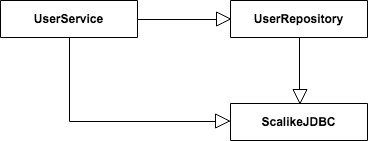
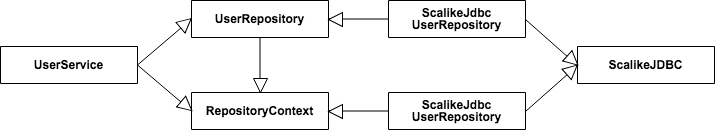

### オブジェクトとカプセル化の</br>正しい見方

</br>

<span style="font-size: 80%">2018-09-21</span>

<span style="font-size: 80%">@orepuri</span>

---
### 自己紹介

* <span style="font-size: 80%">ソフトウェアエンジニア</span>

* <span style="font-size: 80%">インターネット広告業界で約14年間勤務</span>

* <span style="font-size: 80%">フリーランス</span>

* <span style="font-size: 80%">Scala, Java</span>

---
### 本日の話

* オブジェクト指向

* オブジェクトやカプセル化の正しい見方

Note:
オブジェクト指向について, オブジェクトやカプセル化の正しい見方について

---
### オブジェクト指向

<span style="font-size:70%">オブジェクト/カプセル化/継承/ポリモーフィズム</span>

<span style="font-size:70%">多くのプログラミング言語がサポート</span>

</br>
<span style="font-size:70%">オブジェクト指向ならソフトウェアが開発しやすくなる..</span>

Note:
最近関数型言語も話題に

---
### 現実は厳しい

* <span style="font-size:80%">修正する箇所がわかりずらい</span>

* <span style="font-size:80%">修正箇所が多い</span>

* <span style="font-size:80%">直接関係ない箇所で不具合が起こる</span>


---
### 変更しやすいコードにするために

</br>
<span style="font-size:80%">オブジェクト指向の表面的な概念だけでなく </br>本質を理解する必要がある</span>

* <span style="font-size:70%">オブジェクト</span>

* <span style="font-size:70%">カプセル化</span>

Note:
オブジェクトとカプセル化にしぼって話す

---
### オブジェクトの表面的な見方

</br>
データとメソッドをまとめたもの

---
### オブジェクトの本質的な見方

</br>
責務を備えた実態


---
### <span style="font-size:70%">データとメソッドをまとめたもの</span>

* <span style="font-size:80%">どういうデータを持つのか</span>

* <span style="font-size:80%">メソッドをどう実装するか</span>

*オブジェクトの実装に焦点があたる*


---
### 責務を備えた実態

* <span style="font-size:80%">何の責務を持つのか</span>

* <span style="font-size:80%">責務を果たすためにどのような振る舞いが必要か</span>

*オブジェクトの概念と振る舞いに焦点があたる*

---
### 例

ユーザーのパスワードを変更する

Note:
単純なユースケース

---
### 実装に焦点をあてる

<span style="font-size:70%">ScalikeJDBCで永続化を実装</span>
```scala
class UserRepository {

  def update(user: User)(implicit session: DBSession) = {
    sql("UPDATE users set name = ?, password = ?, ...")
      .bind(user.name, user.password, ...)
      .update
      .apply()
  }

  def find(id: UserId)(implicit session: DBSession) = { ... }

}
```

Note:
コードはScalaで, ScalikeJDBCというDBライブラリを使用
UserRepositoryはユーザーのデータを永続化するクラス

---
### 実装に焦点をあてる

```scala
class UserService(repository: UserRepository) {
  def changePassword(id: UserId, newPassword: Password) = {
    val hashedPassword = hash(newPassword)
    // UserServiceがScalikeJDBCが使われていることを知っている!
    DB localTx { implicit session =>
      repository.find(id) flatMap { user =>
        repository.update(user.change(hashedPassword))
      }
    }
  }
}
```

Note:
UserRepositoryを使うUserServiceクラス

---
### 依存関係

<div style="text-align:center;">
  
</div>

Note:
UserServiceもScalikeJDBCに依存している

---
### 問題点

* <span style="font-size:70%">DBライブラリを変更したくなったら?</span>

* <span style="font-size:70%">ストレージを変更したくなったら? Redis, S3, etc...</span>

<span style="font-size:70%">*UserRepositoryの実装だけでなく</br>依存しているUserServiceも修正が必要*</span>

<span style="font-size:70%">*テストコードでもScalikeJDBCを意識する必要がある*</span>


---
### 責務に焦点をあてる

```scala
// 永続化に必要なコンテキストを持つ (DB/KVSのセッション等)
trait RepositoryContext

// ユーザーを永続化する責務を持つ
trait UserRepository[C <: RepositoryContext] {
  def update(user: User)(implicit context: C)
  def find(id: UserId)(implicit context: C)

  def createContext: C
}
```

---
### 責務に焦点をあてる

```scala
// DB(ScalikeJDBC)の実装
class ScalikeJdbcUserRepository[ScalikeJdbcContext] extends UserRepository {
  def update(user: User)(context: ScalikeJdbcContext) = {
    implicit val session = context.session
    sql("UPDATE users set name = ?, password = ?, ...")
      .bind(user.name, user.password, ...)
      .update
      .apply()
  }
}
// Redisの実装
class RedisUserRepository[RedisContext] extends UserRepository { ... }
// S3の実装
class S3UserRepository[S3Context] extends UserRepository { ... }
```

Note:
UserRepositoryの実装クラス

---
### 責務に焦点をあてる

```scala
class UserService(repository: UserRepository) {
  def changePassword(id: UserId, newPassword: Password) = {
    val hashedPassword = hash(newPassword)
    implicit val context = repository.createContext
    repository.find(id) flatMap { user =>
      repository.update(user.change(hashedPassword))
    }
  }
}
```

Note:
ScalikeJDBCのAPIに依存しなくなった

---
### 依存関係

<div style="text-align:center;">
  
</div>

Note:
先程より複雑だが, UserServiceからScalikeJDBCの依存がなくなった

---
### 実装に焦点をあてた場合

* <span style="font-size:70%">DBの処理を実装する</span>
* <span style="font-size:70%">実装されたDB処理を使ってUserServiceを実装する</span>

</br>
*オブジェクト間の依存関係(結合度)を軽視しがち*


---
### 責務に焦点をあてた場合

* <span style="font-size:70%">UserServiceはパスワードを更新する必要がある</span>
* <span style="font-size:70%">永続化も必要</span>
* <span style="font-size:70%">ただし永続化はRepositoryの責務として</br>UserServiceは詳細を関知しない</span>

*実装よりもオブジェクト間の関係が重視される*

*依存度が弱くなりコードが変更しやすくなる*

---
### カプセル化の表面的な見方

データを隠蔽したもの

---
### カプセル化の本質的な見方

データだけでなく, あらゆるものを隠蔽すること

* データ
* 実装
* 派生クラス(型)
* 設計の詳細
* 実体化


---
### 実装/派生クラスのカプセル化

* <span style="font-size:80%">UserServiceからRepositoryの実装が隠蔽されている</span>

* <span style="font-size:80%">UserServiceからRepositoryの派生クラス(型)が隠蔽されている</span>


---
### 設計/実体化のカプセル化

* デザインパターン
    * Adapter/Facade/Factory

* <span style="font-size:80%">サードパーティーのライブラリやAPIを隠蔽</span>

* <span style="font-size:80%">既存のレガシーシステムを隠蔽</span>

* <span style="font-size:80%">オブジェクトの複雑な生成ロジックを隠蔽</span>

* <span style="font-size:80%">生成されるオブジェクトの実際の型を隠蔽</span>

---
### カプセル化はあらゆるものを隠蔽する

* <span style="font-size:70%">コード中のデータ, 実装, 型, 設計, 実体化が隠蔽されているか</br>意識するようになる</span>

* <span style="font-size:70%">実際に隠蔽することで, オブジェクト間の結合度が下がり</br>変更しやすいコードになる</span>


---
### まとめ

* <span style="font-size:70%">オブジェクトは責務を持った実体</span>

* <span style="font-size:70%">カプセル化はあらゆるものを隠蔽する</span>

* <span style="font-size:70%">変更しづらいコードはデータやメソッド, 型など様々なものがオブジェクト間で強く依存している</span>

* <span style="font-size:70%">上記のようにとらえることで, オブジェクト間の依存関係を弱くして変更しやすいコードになる</span>

---
### 参考文献

* <span style="font-size:70%">オブジェクト指向のこころ (2004)</span>
    * <span style="font-size:70%">第8章 視野を広げる</span>
    * <span style="font-size:70%">原書 Design Patterns Explained: A New Perspective on Object-Oriented Design (2001)</span>


